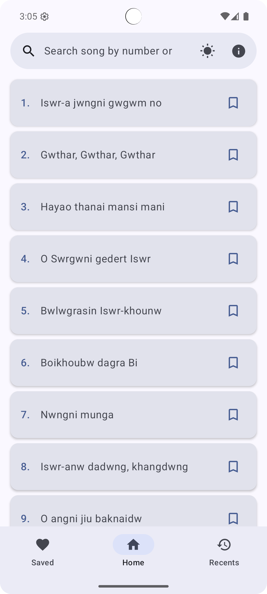
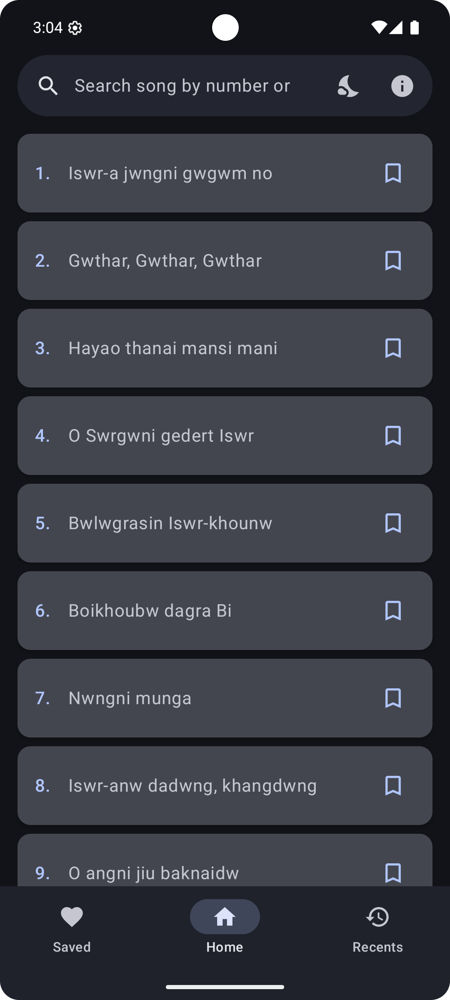
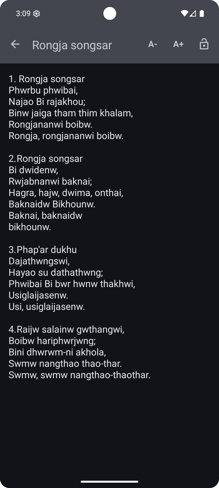
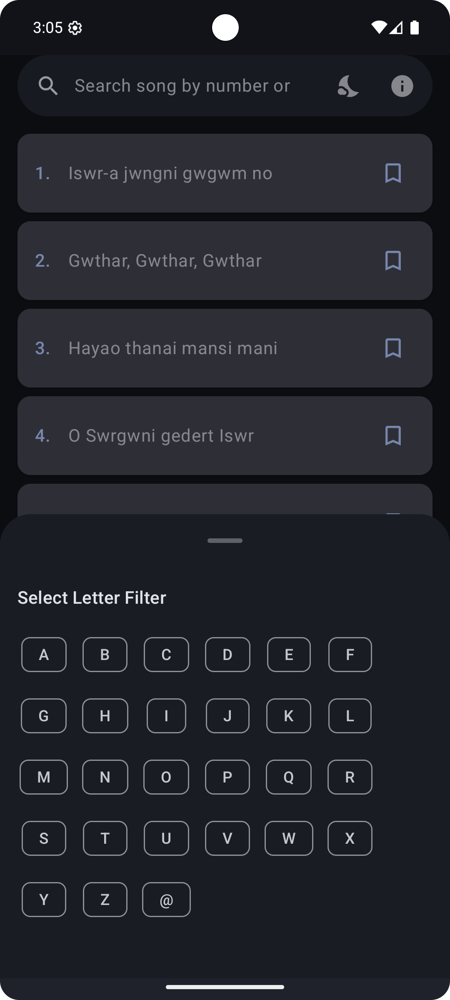
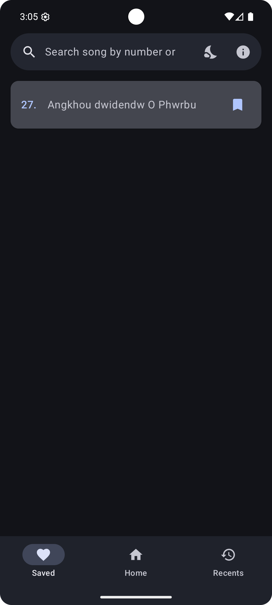
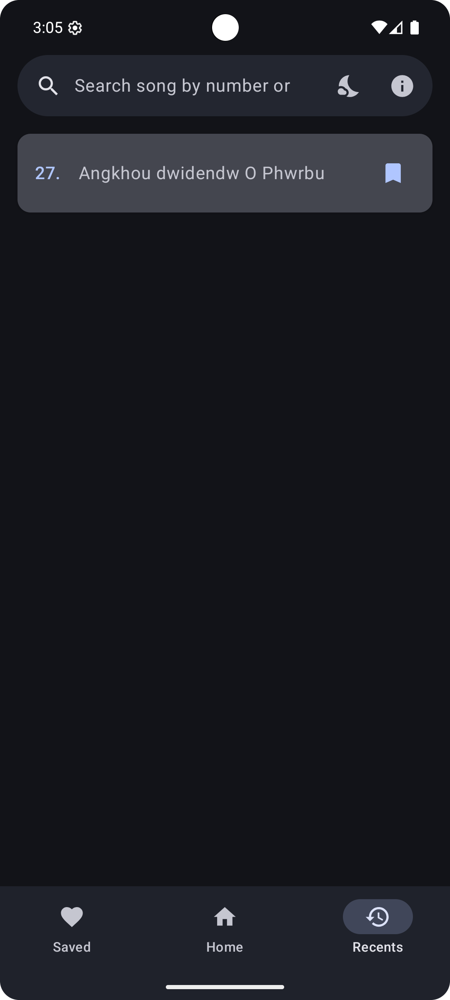

# Boro Rwjab Bilai

 [](https://opensource.org/licenses/Apache-2.0) 

A modern Android application for viewing and singing along to Boro songs. Built with **Kotlin** and **Jetpack Compose**, focusing on a clean Material 3 interface and smooth user experience.

## ✨ Features

*   **Song Library**: Browse a comprehensive collection of Boro songs (loaded locally from JSON).
*   **Smart Search**: Advanced search with weighted priority (Title > Lyrics) and category filtering.
*   **Favorites & Recents**: Quickly access your favorite songs and recently viewed tracks.
*   **Lyrics View**: 
    -   **Rich Text**: HTML support for formatted lyrics.
    -   **Font Controls**: Adjustable text size for better readability.
    -   **Screen Awake**: Option to keep the screen on while singing.
    -   **Gesture Navigation**: Swipe right to easily return to the song list.
*   **Smooth Navigation**: 
    -   **Animations**: Fluid slide and fade transitions between screens.
    -   **Filtering**: Alphabetical filtering via swipe-up gesture.
    -   **Tabs**: Seamless switching between Home, Favorites, and Recents.
*   **High Performance**: Automatic support for high refresh rate displays (90Hz/120Hz).
*   **Theme Aware**: Fully supports Dark and Light modes (system default or toggle within app).
*   **Developer Info**: Integrated access to social links and contact information.

## 📸 Screenshots

| Home (Light) | Home (Dark) | Song View |
|:---:|:---:|:---:|
|  |  |  |

| Filters | Favourites | Recents |
|:---:|:---:|:---:|
|  |  |  |

## 🛠️ Tech Stack

*   **Language**: Kotlin
*   **UI Framework**: Jetpack Compose (Material 3)
*   **Architecture**: Modularized MVVM (Components, Screens, Repositories)
*   **Image Loading**: Coil (SVG support)
*   **Data Parsing**: GSON
*   **Design**: Material Design 3
*   **Build System**: Gradle (Kotlin DSL)

## 📱 Prerequisites

*   Android Studio Ladybug (or newer)
*   JDK 17
*   Android Device/Emulator (Min SDK 23)

## 🚀 Building the Project

### Clone the Repository
```bash
git clone https://github.com/Badmaneers/bororwjabbilai.git
cd bororwjabbilai
```

### Build with Gradle
You can build the project using the included Gradle wrapper:

```bash
# Build Debug APK
./gradlew assembleDebug

# Run Unit Tests
./gradlew test

# Run Android Tests
./gradlew connectedAndroidTest
```

## 🐛 Bug Fixing & Reporting

Found a bug or have a suggestion? We'd love to hear from you!

1.  **Check existing issues**: Verify if the bug has already been reported.
2.  **Open a new issue**: Provide details about the bug (device, steps to reproduce, screenshots).
3.  **Email**: Send directly to `dukebraham24@gmail.com`.
4.  **Telegram**: Message us at `@dumbdragon`.

## 🤝 Donation & Support

If you find this project useful and would like to support its development, you can reach out via:

*   **Email**: `dukebraham24@gmail.com`
*   **Telegram**: [`@dumbdragon`](https://t.me/dumbdragon)

Support helps in maintaining the server (if applicable) and motivating further development!

## 📄 License

This project is licensed under the **Apache License 2.0**. See the [LICENSE](LICENSE.txt) file for details.
