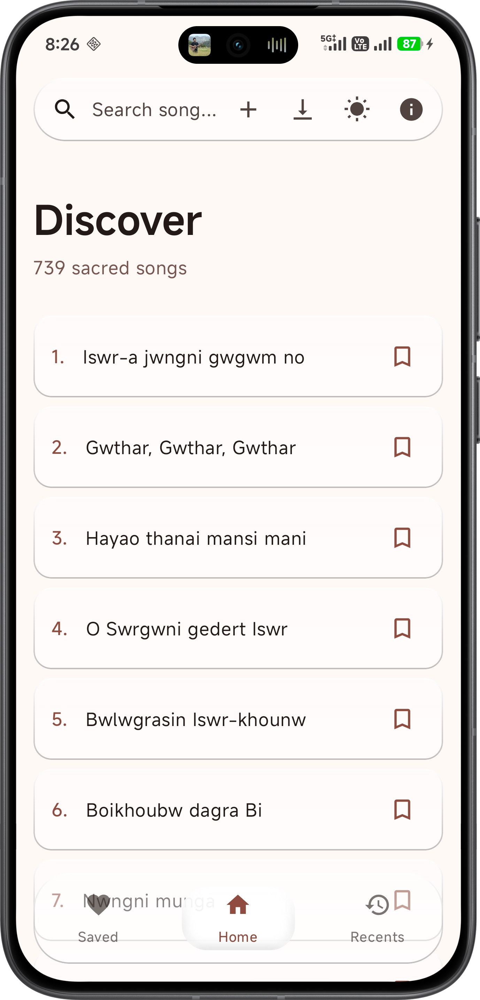
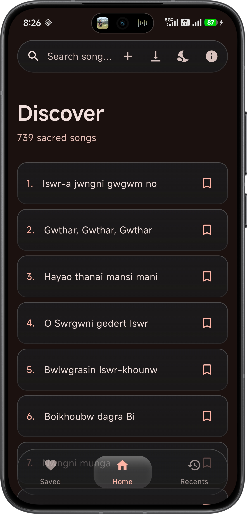
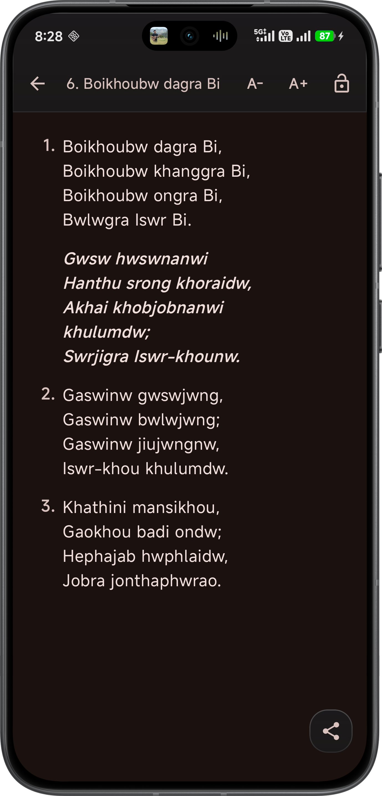
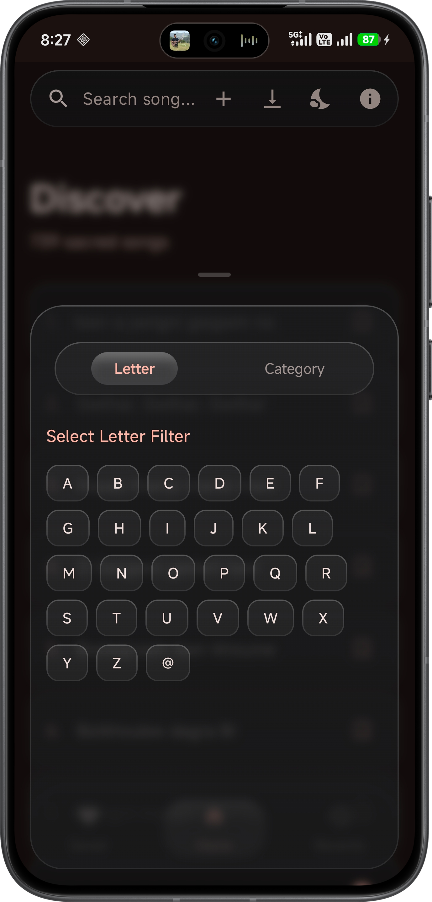
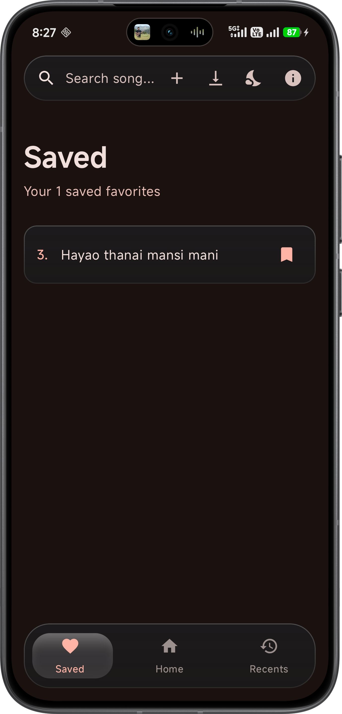
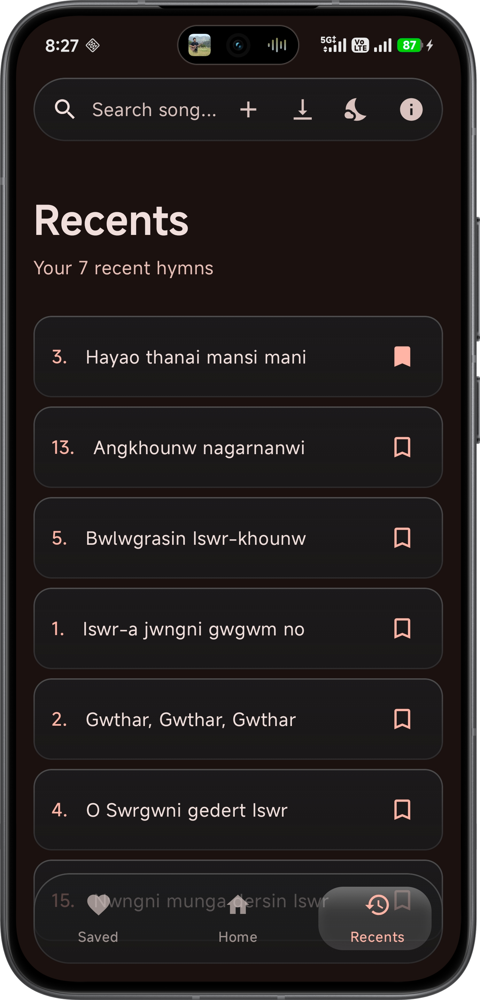

# Boro Rwjab Bilai

 [](https://opensource.org/licenses/Apache-2.0) 

A modern Android application for viewing and singing along to Boro songs. Built with **Kotlin** and **Jetpack Compose**, focusing on a premium **"Liquid Glass"** interface and smooth user experience.

## ✨ Features

*   **Premium Design**:
    -   **Liquid Glass UI**: Consistent glassmorphism effect across song cards, navigation bars, and search interfaces.
    -   **Frosted Backgrounds**: Dynamic real-time blur for search and filter overlays.
    -   **Haptic Physics**: Bouncy, organic animations for navigation indicators and button interactions.
*   **OCR Lyrics Scanner (Beta)**:
    -   **On-Device AI**: Powered by Google ML Kit for fast and private text recognition.
    -   **Precision Capture**: Integrated CameraX interface with a visual alignment frame and automatic image cropping.
    -   **Smart Parsing**: Intelligently detects and formats scanned text into song verses.
*   **Custom Song Management**:
    -   **Create & Edit**: Fully featured editor to create your own Boro songs with support for multiple verses and choruses.
    -   **Local Storage**: All custom songs are saved securely on your device.
    -   **Import/Export**: Share your custom songs with others using generated song codes.
*   **Song Library**: Browse a comprehensive collection of Boro songs (loaded locally from JSON).
*   **Advanced Search**:
    -   **Lyric Previews**: Smart snippets in search results that highlight matching lyrics with surrounding context.
    -   **Weighted Results**: Prioritizes matching titles and song IDs.
*   **Favorites & Recents**: Quickly access your favorite songs and recently viewed tracks.
*   **Intelligent Maintenance**:
    -   **Daily Update Detection**: Smart update checks that run only once per day to optimize battery and data usage.
    -   **High Refresh Rate**: Automatic support for 90Hz/120Hz displays for fluid scrolling.
*   **Theme Aware**: 
    -   **Dark Mode Native**: Now defaults to an elegant Dark Theme for better readability and eye comfort.
    -   **High Contrast Light Mode**: Refined light mode with sharp highlights for glass visibility.

## 📸 Screenshots

| Home (Light) | Home (Dark) | Song View |
|:---:|:---:|:---:|
|  |  |  |

| Filters | Favourites | Recents |
|:---:|:---:|:---:|
|  |  |  |

## 🛠️ Tech Stack

*   **Language**: Kotlin
*   **UI Framework**: Jetpack Compose (Material 3)
*   **Architecture**: Modularized MVVM (Components, Screens, Repositories)
*   **AI/OCR**: Google ML Kit (Text Recognition Latin)
*   **Hardware**: CameraX (Camera core, lifecycle, and view)
*   **Image Loading**: Coil (SVG support)
*   **Data Parsing**: GSON
*   **Design**: Custom Liquid Glassmorphism System
*   **Build System**: Gradle (Kotlin DSL) with JDK 21

## 📱 Prerequisites

*   Android Studio Ladybug (or newer)
*   JDK 21
*   Android Device/Emulator (Min SDK 23)

## 🚀 Building the Project

### Clone the Repository
```bash
git clone https://github.com/Badmaneers/bororwjabbilai.git
cd bororwjabbilai
```

### Build with Gradle
You can build the project using the included Gradle wrapper:

```bash
# Build Debug APK
./gradlew assembleDebug

# Run Unit Tests
./gradlew test

# Run Android Tests
./gradlew connectedAndroidTest
```

## 🐛 Bug Fixing & Reporting

Found a bug or have a suggestion? We'd love to hear from you!

1.  **Check existing issues**: Verify if the bug has already been reported.
2.  **Open a new issue**: Provide details about the bug (device, steps to reproduce, screenshots).
3.  **Email**: Send directly to `dukebraham24@gmail.com`.
4.  **Telegram**: Message us at `@dumbdragon`.

## 🤝 Donation & Support

If you find this project useful and would like to support its development, you can reach out via:

*   **Email**: `dukebraham24@gmail.com`
*   **Telegram**: [`@dumbdragon`](https://t.me/dumbdragon)

Support helps in maintaining the server (if applicable) and motivating further development!

## 📄 License

This project is licensed under the **Apache License 2.0**. See the [LICENSE](LICENSE.txt) file for details.
